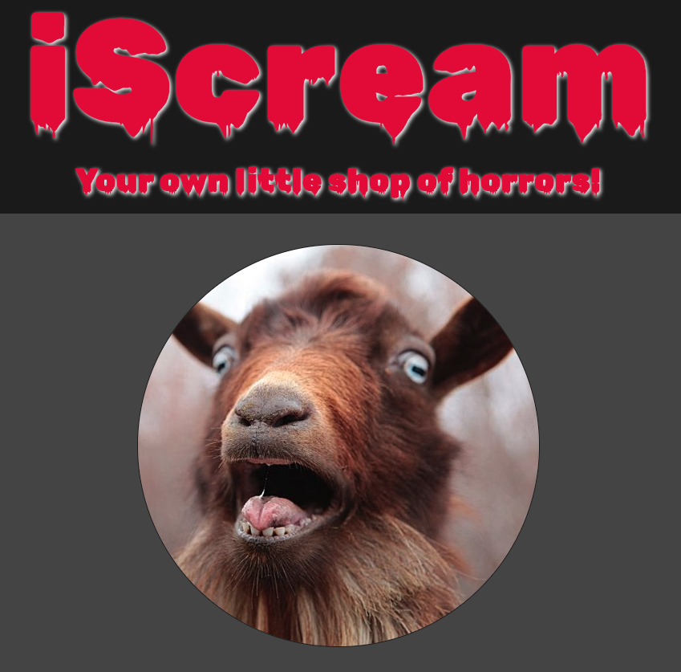
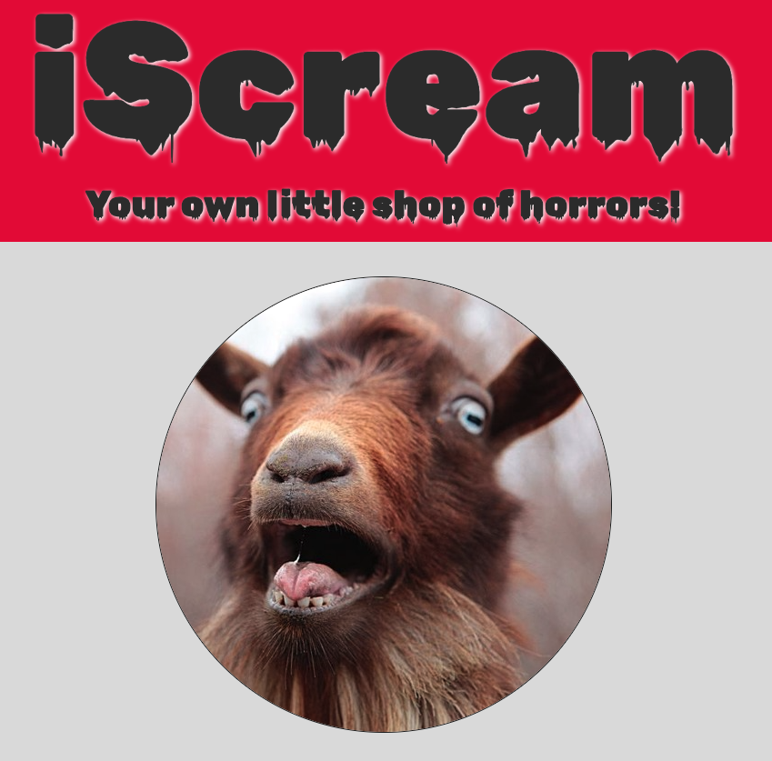

# [Not so] Sweet Treat: Ice Cream Shop

Welcome to my first ever Hack-A-Thon!

I am extremely excited to showcase my application of the skills I have learned so far with Devslopes.

Prepare to journey into the depths of your worst frustrations, as this shop is full of flavors that make you want to Scream.

Now serving:

- Dark / Light mode toggle button on the top of every page!
- Audio clip on the home page!
- Hover animated buttons!
- 15 interactive flavors!

Languages Used:

- HTML
- CSS

# HOW TO:

[ ] Download or clone this repository to your computer.
[ ] Open the 'index.html' in your browser with Live Server
[ ] Toggle between Dark/Light modes via the button on the top of the page.
[ ] Click the play button below the goat to hear reviews from our cuss-tomers!
[ ] Browse our inventory and select a flavor to read its description.
[ ] Scream!

---

The following section describes the

# design process and status updates

during site build.

5/27/25
11:01pm

This README.md doc is intended to document my design process.

I created the initial GitHub Repository earlier today, and learned that every edit needs to be pushed after losing a few hours worth of preliminary work. :/

Today I have submitted the CSS Ransom Note assignment. I feel like I am so close to gathering vital technical skills to bring my original idea of an actual ice cream shop store like appearance to life, with shapes and such. I know what I don't know. and after not really knowing where to begin with the Ransom Note assingment, I feel like I don't really know what I know either.

!!! This inspired a totally new design concept WAY out of the box. i(want to)Scream.
!!! I have gathered in the roughly two weeks of code experience that this is a shared experience coders.

I am excited to test my fundamental, comprehensive knowledge of basic html and css concepts. and to also build a safe, structured platform to vent out some of my favorite frustrations.

11:04pm

Finding and adding fonts to use.
Creating checklist of Evaluation Criteria for later use.
Visual Design & Creativity (35%)
[n] Immersive shop atmosphere
[y]Creative use of animations and effects
[y]Responsive and polished interface
[y]Originality and thematic consistency
Technical Implementation (30%)
[y]Code quality and organization
[y]Responsive design implementation
[y]Performance optimization
[-]JavaScript functionality (where applicable)
User Experience (20%)
[y]Intuitive navigation
[y]Engaging interactions
[y]Accessibility considerations
[y]Overall experience quality
Documentation & Presentation (15%)
[y]Code comments and documentation
[y]Design rationale explanation
[y]Presentation quality
[y]Process documentation

[x] I want to build a header row with some menu buttons on the bottom, centered, with a dark, vampirey theme.

<!-- Buttons will navigate the user to the Who What Where When and Why pages.

Who What Where When and Why pages to have buttons:
[ prev
[ home
[ next -->

^^^ Got rid of those buttons... ^^^

11:56pm

Ready to commit changes to GitHub.
Lessons learned today:
-changes must be commited or will be lost when project is closed.
-practical application of the following:
-html elements
-css selectors, psuedoselectors and specificity
-color attributes: custom, currentColor
-text alignment
-margin settings
-table size settings

5/28/25

9:51am

Just pushed a few hours of work. Problems faced/challenges:
-ID and class attributes w/ psuedo elements
-centering images
-width, margin, borders, etc.

Next to-do:
[x]add more content
[x]link buttons that can be linked whether add pages or to external sites
[x]dark/light mode button linked to dark/light pages

5/29/25

1100a

getting back into the project.
creating more content for additional pages. I've decided to only link a select few to make the hover/link feature more appealing.

Added another page. Revised fonts. Edit background color.

Next to-do:
choose 3x more pages to link.
create 3x more pages and link.
fix links between all pages.

create content for 3x pages.

double check to make sure site functions as intended.

2:25pm

Finally got styling where I want it. and plan for how to attack the functions of the linked pages. Pushing now.

2:48pm

Gathered images for pages. Created images folder. Created blank template of the page to use.

6:47pm

Worked out 8 pages, all functional. Found some styles shortcuts to simplify the styles sheet. Really impressed with the suggestions the VSCode AI is coming up with for my page descriptions!

!!!!!!!!!!!! -> <strong>I never thought these would really be ice cream flavors...</strong>

5/30/25

11:04am

Finished! got everything linked, all pages fitted with an ice cream flavor description and image.

Next I'm going to attempt to play around with a dark/light themed toggle.

YES pushing now.

1:35pm

Created light theme. Built pages for all the light theme pages. Left off after pages 03of15 built.

2:06pm

DONE.
Built and connected all Light Themed pages, respectively.
Created and linked a 404 Error page.

Site works, looks great, and I'm actually very happy with the overall product!!

The process taught me alot and really tested my knowledge of basic html and css concepts such as:

- style sheets
- html elements and their properties
  -div
  -span
  -p
  -table
- padding vs margins
- border radius
- images- positioning and resizing
- centering elements
- css selectors
- ID, class selectors
- specificity
- FontAwesome
- custom fonts
- and more!

KEY TAKE-A-WAYS:
Most of the time spent on this project was figuring out how seemingly basic concepts worked. Once I got the gist of it, I cranked out copy after copy no problemo. I can only imagine what I can do once these concepts are solidified in my toolbelt.

Overall super stoked and proud of the site for the roughly 10-15 hours I put into it.

# FUTURE IMPROVEMENTS

I really want to learn how to create custom-sized html elements and how to place them exactly where I want them. I believe this is the FlexBox/Grid portion of CSS? Looking forward to diving into more CSS learnings soon!

Again, the original vision for the store was a much more store-like experience, however, realising how little I understood about creating the spacing and positioning for elements, I decided to opt with what I do know to showcase my current skill-level.

Basic additions:

- prev / next buttons to the flavor pages
- Hide the audio player into the goat image.
- ToolTips

Advanced additions:

- Full page demo and rebuild to create a spooky, horrorific immersive shop setting
- animations on hover to increase the scream level!
  - jump scares
- ordering interface
  - cup, cone, etc.
  - flavor selection
  - toppings?
- 'cart' to save built products.
- list view pinned to side to preview items in cart
- checkout process
- thank you page

# Thank you !
